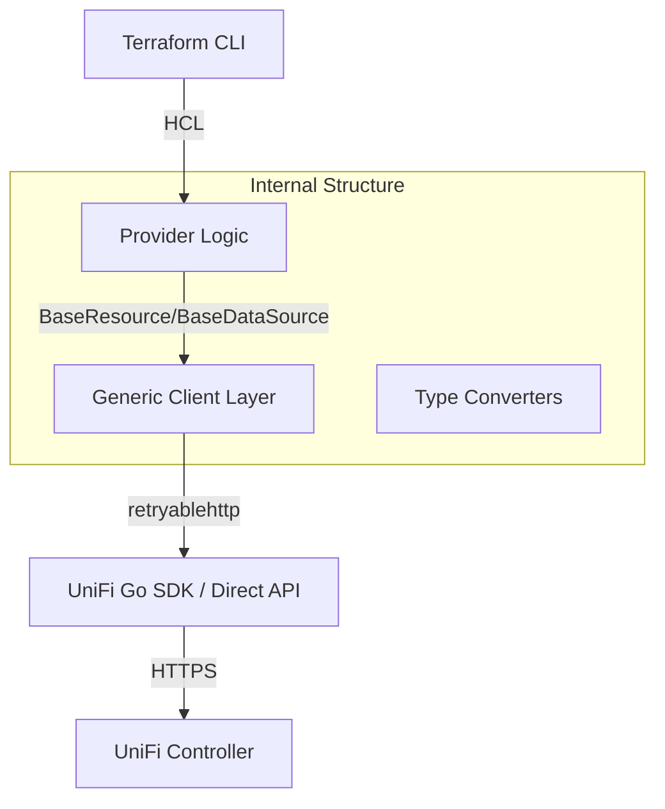

# Terraform Provider for UniFi Network

A Terraform provider to manage UniFi Network resources via the modern Integration API.

## Features
- Manage VLANs, Subnets, and User Groups.
- Configure Firewall rules and Port Profiles.
- Support for API Key (Token) and Username/Password authentication.
- Headless testing environment with Docker.

## Authentication
The provider supports both legacy and modern authentication:

```hcl
provider "unifi" {
  host          = "https://192.168.1.1"
  api_key       = var.unifi_api_key
  is_standalone = true # Set to true for standalone controller installations
}
```

## Documentation
See [docs/index.md](docs/index.md) for full documentation.

## Example Usage
```hcl
provider "unifi" {
  host    = "https://192.168.1.1"
  api_key = var.unifi_api_key
}

resource "unifi_network" "home_vlan" {
  name    = "Home Devices"
  vlan_id = 10
  subnet  = "192.168.10.1/24"
}
```

## Architecture

The provider is built with a focus on maintainability, resilience, and standard Terraform patterns.



### Key Components

*   **Generic Client Layer (`internal/client`)**: Leverages Go 1.25 generics to provide unified, type-safe handlers for both v1 REST and v2 APIs. This architecture reduces boilerplate by 60% and ensures consistent error handling across all resources.
*   **Base Class Pattern (`provider/base.go`)**: All resources and data sources inherit from common base classes. This enforces standard metadata handling and guarantees that every entity has access to a consistently initialized, retry-capable client.
*   **Resilient Communication**: Integrated `go-retryablehttp` to automatically handle transient network issues, rate limits (`429`), and internal controller errors (`5xx`) with exponential backoff.
*   **Zero-Touch Test Harness**: A fully automated Docker environment that utilizes MongoDB seeding to bypass the UniFi Setup Wizard, enabling seamless CI/CD and rapid local development.

## Development
See [CONTRIBUTING.md](CONTRIBUTING.md) for details on how to build and test the provider.
